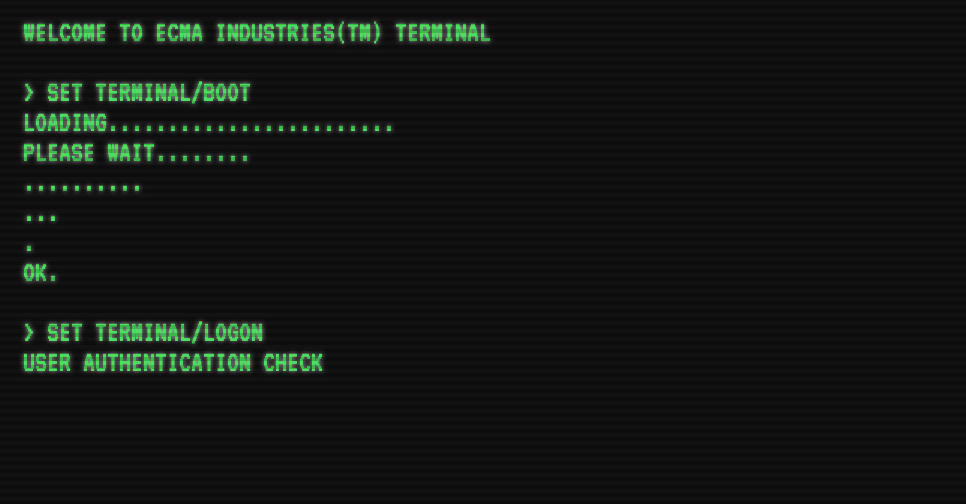
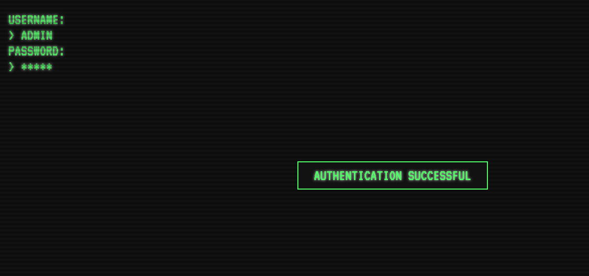
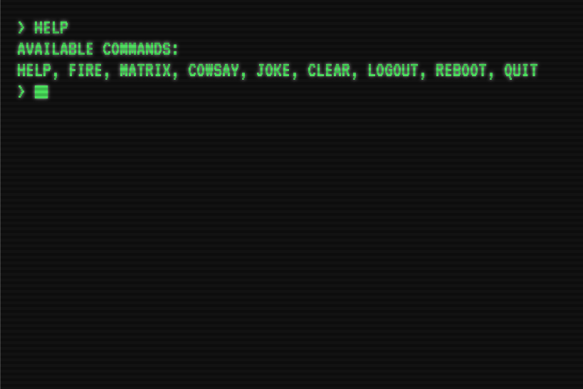

# CRT Terminal Emulator

Run a CRT Terminal in the browser. Rememeber the old days of dumb terminals, green screens, and slow response times!

I was thinking about building a game with this some day but for now you can get an idea of how it would work. There is nothing but HTML, CSS, and vanilla JavaScript in this puppy.

### Booting up... (animated of course)

---

### Logging in... (credentials are Top Secret)

---

### Help command showing typical circa 1980 commands...

---

Of course you can just click and view the demo yourself...
[View Demo](https://34fame.github.io/crt-terminal-emulator/)
